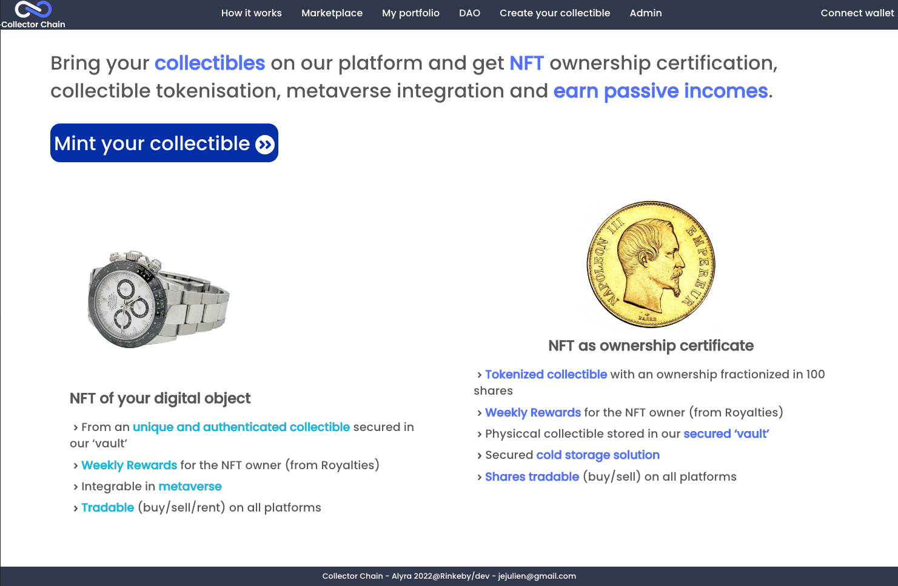

# Collector Chain - Tokenized collectible - MVP Alyra 2022 / Developer class Rynkeby

## Project presentation
### Overview
Collector Chain is a collectibles tokenization platform : https://collector-chain-tokenized-collectibles.vercel.app/

By submitting a request to a DAO of enthusiasts, each user will be able to tokenize a unique physical object that they own (numbered or collectible).

Once the request has been accepted and valued by the DAO, two types of NFT from the object can be created :
- A "owership certificate" NFT, split into 100 and allowing the purchase/sale of the real ownership of the object. The owner must transmit the object to collector chain to be able to mint the NFTs

- A unique 'digital object' NFT that can be sold, worn or rented for use in the web3 world

### Live demonstration
- Part 1 : https://www.loom.com/share/6dceb37211794878a3b0f6672a82ff9a
- Part 2 : https://www.loom.com/share/bda1df8b3c8a44268f4a2cb5becca646
- Part 3 : https://www.loom.com/share/10ba363ce43944f49094f5bd4b29688e

## Getting started

- Run `npm install` in `./truffle/`and `./client` directories
- Launch a local blockchain with ganache or other provider
- Launch projet by running `npm start`in `./client` directory
- Open [http://localhost:3000](http://localhost:3000) to view it in your browser.

## Build with 
- React
- Truffle
- Web3 JS
- React suite library

## Test
Only 'dao' contract fully tested. Others have to be done 

## Licence
Distributed under the GPL-3.0 License

## Contact
Jérôme JULIEN - Twitter @jerome_0x_dev - https://www.linkedin.com/in/jerome-0x-dev/ - https://github.com/JeromeJULIEN/CollectorChain_TokenizedCollectibles